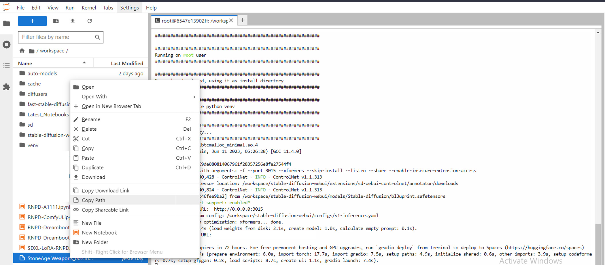
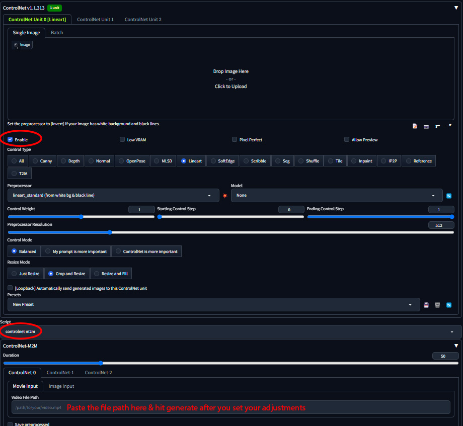

# Enhanced ControlNet M2M for Stable Diffusion on RunPod

Welcome to my repository where I share an enhanced version of the `movie2movie.py` script, tailored for artists and creators using Stable Diffusion on RunPod.

## About the Script

This script is a modified version of the original `movie2movie.py` used in Stable Diffusion. It includes additional features and improvements to cater to the needs of artists, especially those working in cloud environments like RunPod.

### Key Enhancements
- **Video Path Input:** A new textbox for manual video path input, making it easier to use in cloud environments.
- **Improved Directory Handling:** The script now checks and creates output directories, ensuring smoother operation.
- **Enhanced Debugging:** Additional print statements for better troubleshooting and verification.

## Requirements
- Stable Diffusion installed on RunPod.
- "Allow other scripts to control this extension" option enabled in Stable Diffusion UI settings.

## Getting Started
1. Place your video file in the RunPod environment.

2. Input the path of the video in the provided textbox.
3. Run the script as usual in Stable Diffusion.

## Contributing
Feel free to fork this repository and contribute. If you encounter any issues or have suggestions, please open an issue or submit a pull request.

## Acknowledgments
Thanks to the Stable Diffusion community for their continuous support and inspiration.

## License
MIT License

Copyright (c) 2023 NedzZone

Permission is hereby granted, free of charge, to any person obtaining a copy
of this software and associated documentation files (the "Software"), to deal
in the Software without restriction, including without limitation the rights
to use, copy, modify, merge, publish, distribute, sublicense, and/or sell
copies of the Software, and to permit persons to whom the Software is
furnished to do so, subject to the following conditions:

The above copyright notice and this permission notice shall be included in all
copies or substantial portions of the Software.

THE SOFTWARE IS PROVIDED "AS IS", WITHOUT WARRANTY OF ANY KIND, EXPRESS OR
IMPLIED, INCLUDING BUT NOT LIMITED TO THE WARRANTIES OF MERCHANTABILITY,
FITNESS FOR A PARTICULAR PURPOSE AND NONINFRINGEMENT. IN NO EVENT SHALL THE
AUTHORS OR COPYRIGHT HOLDERS BE LIABLE FOR ANY CLAIM, DAMAGES OR OTHER
LIABILITY, WHETHER IN AN ACTION OF CONTRACT, TORT OR OTHERWISE, ARISING FROM,
OUT OF OR IN CONNECTION WITH THE SOFTWARE OR THE USE OR OTHER DEALINGS IN THE
SOFTWARE.

---

Note: This script is intended for artistic and creative purposes. Please use it responsibly and ethically.
